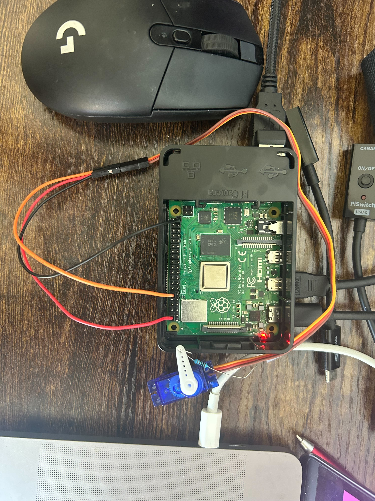

# Making a motor do things with Rust and a Raspberry Pi

This is a simple example mostly lited directly from the rppal hardware PWM [example](https://github.com/golemparts/rppal/blob/master/examples/pwm_servo.rs). I just ran into a few setup issues and wanted to document how I got it working (mostly for when I inevitably forget a step).

<!-- Image of hardware setup -->


### Setup Raspberry Pi

Standard setup for rpi is [here](https://projects.raspberrypi.org/en/projects/raspberry-pi-setting-up/1) and works fine for this, except for possibly the error below. Don't bother with the fix unless you're getting the error.

Set up ssh access to the pi (see [here](https://www.raspberrypi.com/documentation/computers/remote-access.html) for details). I also assigned a static IP to the pi in my router so I could just alias the connect and mount commands, but you could also just look them up each time by running `hostname -I` on the pi.

If, when running `cargo run` (or running the built artifact), you're getting `Error: Io(Os { code: 2, kind: NotFound, message: "No such file or directory" })`, then try adding the following line to the end of your `/boot/config.txt` file:

```
dtoverlay=pwm,pin=18,func=2
```

(thanks @drauschenbach for the fix [here](https://github.com/golemparts/rppal/issues/73#issuecomment-894719861))

### Setup sshfs for easy editing of files on the pi

Install sshfs (and fuse if you're on Mac) on your local machine (one tutorial [here](https://eengstrom.github.io/musings/install-macfuse-and-sshfs-on-macos-monterey)).

After some experimentation I settled on the following for connecting and mounting the pi (sshfs is a bit flaky, and I found that the `reconnect` and `workaround=all` options helped but ymmv):

```
alias connect_pi="ssh pi@192.168.1.64"
alias mount_pi="diskutil umount force ~/rpi/; sshfs -C -o reconnect -o workaround=all -o IdentityFile=/path/to/ssh/private/key pi@192.168.1.64:/home/pi /Users/bws/rpi"
```

### Install Stuff for Cross Compiling

NB: For cross compiling with [`cross`](https://github.com/cross-rs/cross) you need Docker running.

```
# run on your macbook to generate the cross compiled binary for the rpi
# if you're on the rpi you can just run `cargo build`
cargo install cross
cross build --target armv7-unknown-linux-gnueabihf # or specify the target in your .cargo/config
```

### Some resources that I found helpful

- [Lisa Passing's Rust Linz talk](https://www.youtube.com/watch?v=IgC2HvBesms)
- [Gary Explains' Servo PWM video](https://www.youtube.com/watch?v=_fdwE4EznYo)
